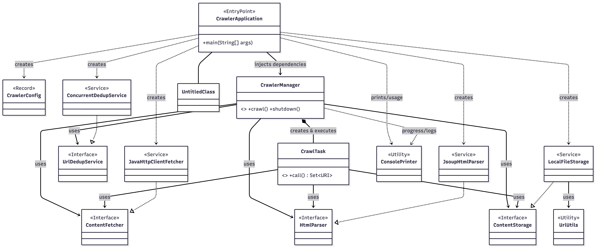

# Voyager Crawler (Java 21) - Home Task Submission

## Overview
This repository contains a simple, multi-threaded web crawler implemented in Java 21 using virtual threads (Project Loom). The goal is to satisfy the home task requirements while keeping the code modular, testable, and easy to run from the command line.

The crawler performs breadth-first traversal by depth, stores each downloaded page to disk, and optionally enforces global URL uniqueness across all depths.

## Assignment Requirements Coverage
- Accepts 4 CLI arguments: seed URL, maximum links per page, maximum depth, and cross-level uniqueness flag.
- Breadth-first crawl by depth (0..maxDepth) with per-page link extraction limits.
- Stores each downloaded page using the required `<depth>/<url>.html` naming convention.
- Uses Gradle (Groovy DSL) and Java 21.
- Uses multithreading via virtual threads.
- Shuts down gracefully after completing the crawl.

## Architecture
The crawler follows a layered architecture with clear separation of concerns:


## Project Dependencies
The project uses the following main dependencies:



## Build and Run
### Prerequisites
- JDK 21+ (the build uses a Java 21 toolchain).
- Network access for fetching pages.

### Run with Gradle
```bash
./gradlew run --args="https://www.ynetnews.com 5 2 true"
```

Windows:
```bash
gradlew.bat run --args="https://www.ynetnews.com 5 2 true"
```

### Build a Runnable JAR
```bash
./gradlew jar
java -jar build/libs/voyager-crawler-1.0.0.jar https://www.ynetnews.com 5 2 true
```

## CLI Arguments
1. `seedUrl` - Starting URL. Must start with `http://` or `https://`.
2. `maxLinksPerPage` - Maximum number of links to follow from each page (non-negative integer).
3. `maxDepth` - Maximum traversal depth (0 = only the seed page).
4. `isUnique` - `true` for global uniqueness across all depths, `false` to allow revisits across depths.

Invalid arguments result in a clear error message and usage output.

## Output Layout
The crawler creates a timestamped output directory under `crawled_data/`:

```
crawled_data/
  crawler_output_YYYYMMDD_HHmmss/
    <depth>/
      <sanitized_url>.html
```

Filename rules:
- The URL is converted to a filesystem-safe name by replacing non `[a-zA-Z0-9.-]` characters with `_`.
- `://` is replaced with `_`.
- Filenames are truncated to 200 characters to avoid OS limits.

Example:
```
crawled_data/crawler_output_20240214_130501/1/https_example.com_page_id_1.html
```

## Crawl Behavior
- Breadth-first traversal: all URLs at a given depth are processed before moving to the next depth.
- Each page contributes up to `maxLinksPerPage` outgoing links, in document order.
- URLs are normalized by removing fragments (`#...`).
- Only HTTP(S) links are kept.
- When `isUnique=true`, the crawler never revisits a URL across any depth.
- When `isUnique=false`, revisits across depths are allowed. Within a single depth, duplicates are still collapsed because the next-depth collection is a set.

## Concurrency and Politeness
- Uses `Executors.newVirtualThreadPerTaskExecutor()` to run I/O-bound crawl tasks.
- A semaphore caps concurrent in-flight tasks at 50.
- Each request includes a small randomized delay (50-150 ms).
- Retries up to 3 times for retryable HTTP codes (429, 500, 502, 503) with exponential backoff.
- Non-HTML responses are skipped based on `Content-Type`.

## Error Handling and Shutdown
- Individual URL failures are logged and do not abort the crawl.
- The executor is shut down gracefully, with a forced shutdown if tasks do not finish within 60 seconds.

## Project Structure
- `com.voyager.crawler.CrawlerApplication` - CLI entry point, argument validation, and summary output.
- `com.voyager.crawler.core.CrawlerManager` - Orchestrates breadth-first traversal and deduplication.
- `com.voyager.crawler.core.CrawlTask` - Per-URL fetch, save, and optional link extraction.
- `com.voyager.crawler.io.JavaHttpClientFetcher` - HTTP client with retry/backoff and politeness delay.
- `com.voyager.crawler.io.LocalFileStorage` - Stores HTML under the depth-based directory layout.
- `com.voyager.crawler.parser.JsoupHtmlParser` - Parses HTML and extracts absolute links.
- `com.voyager.crawler.util.UrlUtils` - URL normalization and filename sanitization.
- `com.voyager.crawler.util.ConcurrentDedupService` - Thread-safe deduplication service.

## Tests
Unit tests use JUnit 5 and Mockito and cover:
- URL normalization and filename sanitization.
- Local file storage path creation and output content.
- Crawl depth behavior, branching limit, and uniqueness modes (via mocked dependencies).
- CLI argument parsing.

Run tests:
```bash
./gradlew test
```

## Dependencies
- Jsoup 1.17.2
- JUnit 5 (JUnit BOM)
- Mockito 5.12.0

## Notes and Limitations
- `robots.txt` is not consulted.
- JavaScript is not executed; only static HTML is parsed.
- The rate limiter is a simple global cap, not per-host throttling.
- Content is stored as UTF-8 without additional HTML sanitization.